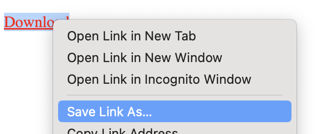

# Subresource Download Links

Author: [Dylan Cutler (Google)](https://github.com/DCtheTall)

# Motivation

Suppose a site, `example.com`, outsources storing its static content to a third-party CDN, which we will call `cdn.example`.
The site would like to offer users the ability to download personalized content which is hosted at `cdn.example`.

When third-party cookies are allowed, `cdn.example` can set a `SameSite=None` cookie which stores a user identifier derived from information provided by `example.com`.
When the user clicks a download link, this `SameSite=None` cookie is sent in the data request by the browser for the file content.

However, when third-party cookies are restricted, `cdn.example` cannot set a `SameSite=None` cookie since it is third-party with respect to the top-level frame, hosted at `example.com`.
Without invoking the [Storage Access API](https://github.com/MicrosoftEdge/MSEdgeExplainers/blob/main/StorageAccessAPI/explainer.md), which will prompt the user, `cdn.example` could set a third-party [`Partitioned` cookie](https://github.com/privacycg/CHIPS) (i.e. CHIPS).
However, the browser treats data requests from clicking on a link with the `download` attribute or from context menus as top-level navigations, and therefore third-party partitioned cookies are not included.

Currently, there is no support for sending a third-party partitioned cookie in a download data request.
A `cdn.example` embed must use the Storage Access API, prompting the user and disrupting the site experience, to read or write cookies that would be sent in download requests.

## Goals

-   To allow third-party sites to send partitioned cookies in download links' data requests

-   To only send any cookies available to third-party subresource requests

## Non-goals

-   To change the behavior of download links for sites who do not opt into using this new feature

-   To require sites to prompt the user in order to send any cookies in a third-party download link's data request

# Proposed Solution

We would like to introduce an extension to the [`download` attribute](https://html.spec.whatwg.org/multipage/links.html#attr-hyperlink-download) on `<a>` tags which would allow a site to opt into having the browser treat the data request as a third-party subresource request instead of a top-level navigation.
For example, the attribute could be extended to support a `subresource` token.
Below is an example of HTML using this new attribute.

```html
<a download="subresource:example.pdf"> Click to download </a>
```

Another alternative could be to introduce a new attribute to use in addition to `download`.

```html
<a subresouce-download="example.pdf"> Click to download </a>
```

If a site opts into this behavior using this new attribute value, the browser will treat the resulting data request as a third-party subresource request originating from an embedded context.
Third-party partitioned cookies will be available by default, and `SameSite=None` cookies will be available if the embed chooses to invoke the Storage Access API and the user accepts the prompt.

When a user right-clicks on a download link that presents a context menu item for downloading the resource, that download will also be treated as a subresource request if the `<a>` tag has the new attribute.


<br>
<caption> Clicking "Save Link As…" will trigger a download for the resource </caption>

## Alternatives considered

### Invoking Storage Access API

One alternative is to require that third-party embeds invoke the Storage Access API in order to use cookies for download requests.
While this solution works for some use cases, it would be preferable to allow embeds to use cookies for download data requests when they opt into doing so in a privacy-preserving way.
To distinguish between these use cases, we propose extending the `download` attribute to support both.

### DNS CNAME'ing

Another option is to have example.com use CNAME records for the user content hosted at `cdn.example`.
This would allow `cdn.example` to use a `SameSite=None` cookie belonging to example.com to access control content.
While this would allow the download request to circumvent cross-site cookie restrictions, there are some security concerns:

-   `cdn.example` would need to acquire and serve TLS certificates issued for `example.com`.

-   All `Domain` cookies set on `myblog.example` get sent to `example.com`, including potentially sensitive data set by other subdomains.

In addition to these concerns, this solution introduces unnecessary complexity for developers that a browser-provided API would not require.

### Related Website Sets service domains

One possible solution is to host the content for download in a [Related Website Sets (RWS)](https://developers.google.com/privacy-sandbox/cookies/related-website-sets) service domain, and use the Storage Access API to grant `SameSite=None` cookie access by default.
While this provides an ergonomic solution for some organizations, we chose to offer a more general API.
We chose to do so because the site hosting the content for download may not be controlled by the same organization as the top-level site, which would make joining the same RWS impossible.

### Loading the file into a Blob

A possible polyfill for a subresource download would be to have a JavaScript click event listener call the following code:

```javascript
async function onDownloadLinkClick() {
  const resp = await fetch('./path/to/file.ext');
  const blob = await resp.blob();
  const picker = await window.showSaveFilePicker();
  const writeable = await picker.createWriteable();
  await writeable.write(blob);
}
```

This approach has a few drawbacks.
First, third-party frames are not allowed to use `window.showSaveFilePicker`, so this could only be called by the main frame.
Also, since this approach loads the file into memory with JavaScript, the size of the file you can download is limited to the capacity of the JavaScript heap.
Chrome, for instance, limits the maximum size of the JavaScript heap for each frame to only a few gigabytes.
Finally, this method bypasses the traditional browser download UI, which could confuse users.

# Privacy and Security Considerations

## Privacy

This API should not allow sites to engage in cross-site tracking without user knowledge.
To that end, when a site opts into using a `download="subresource:..."` link, the resulting data request should only get the state that is available to a subresource request to that same URL from the frame containing the `<a>` tag.
By default, this will include the partitioned cookies set by the site hosting the URL in the currently active cookie jar partition.
Unpartitioned cross-site state will be available to third-party domains in these requests only if they have invoked the Storage Access API and the user has granted access.

## Security

The `download="subresource:..."` API only allows download links to opt into a more restricted security context, where only `SameSite=None` cookies are available, than the download request would have otherwise been initiated from without this API.
Prior to the introduction of this API, download data requests would automatically send `SameSite=Lax/Strict` cookies regardless of the first- or third-partiness of the URL of the downloaded resource with respect to the top-level frame.

The only new state that will be made available in subresource download requests are third-party partitioned cookies.
See the [Security and Privacy Considerations in the CHIPS](https://github.com/privacycg/CHIPS#security-and-privacy-considerations).

Unlike top-level navigation, subresource requests may be intercepted by [Service Workers](https://w3c.github.io/ServiceWorker/).
Since download data requests were not previously visible to workers, we would exclude these subresource requests from the worker's interception mechanism.

We may also wish to exclude [Resource Timing](https://developer.mozilla.org/en-US/docs/Web/API/Performance_API/Resource_timing) headers from these requests as well to prevent the download request leaking any timing information for the download.

# References

-   [HTML Standard](https://html.spec.whatwg.org/)

-   [MicrosoftEdge/MSEdgeExplainers: Home for explainer documents originated by the Microsoft Edge team](https://github.com/MicrosoftEdge/MSEdgeExplainers/)

-   [privacycg/CHIPS: A proposal for a cookie attribute to partition cross-site cookies by top-level site](https://github.com/privacycg/CHIPS)

-   [Related Website Sets | Privacy Sandbox | Google for Developers](https://developers.google.com/privacy-sandbox/cookies/related-website-sets)

-   [Resource timing - Web APIs | MDN](https://developer.mozilla.org/en-US/docs/Web/API/Performance_API/Resource_timing)

-   [Service Workers Nightly](https://w3c.github.io/ServiceWorker/)

-   [What is a DNS CNAME record? | Cloudflare](https://www.cloudflare.com/learning/dns/dns-records/dns-cname-record/)
